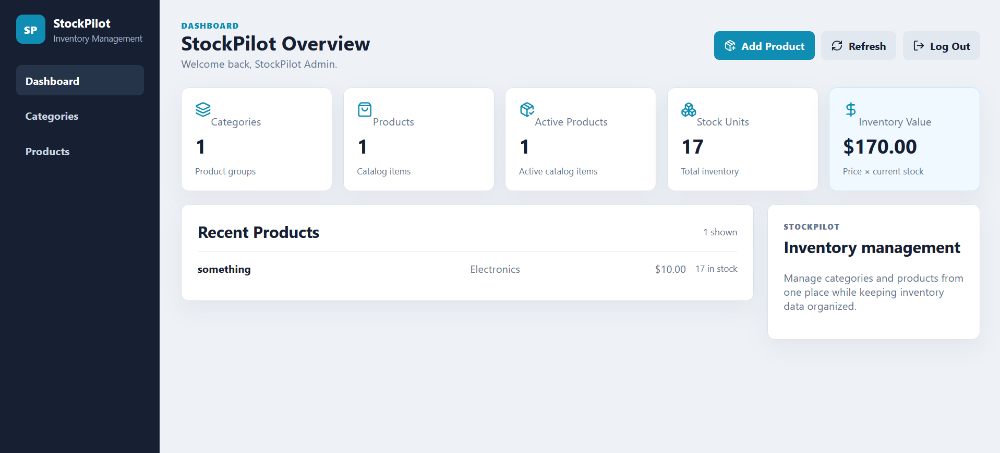
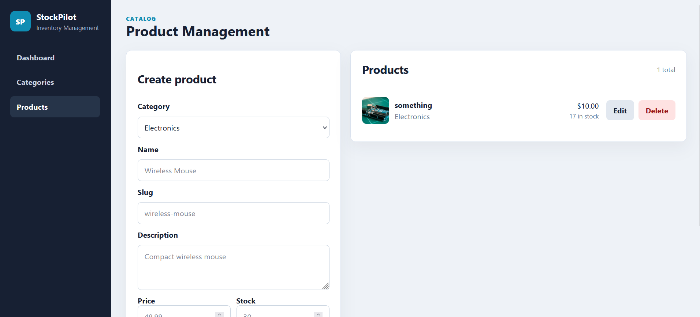
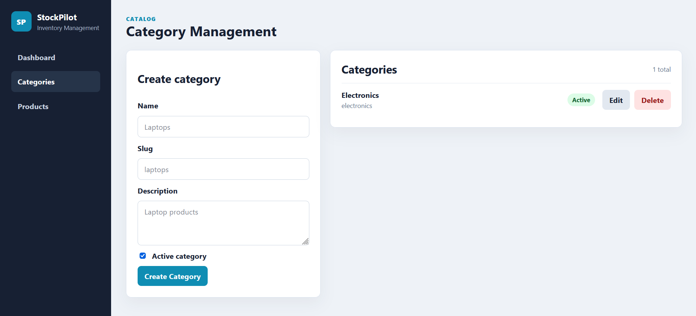
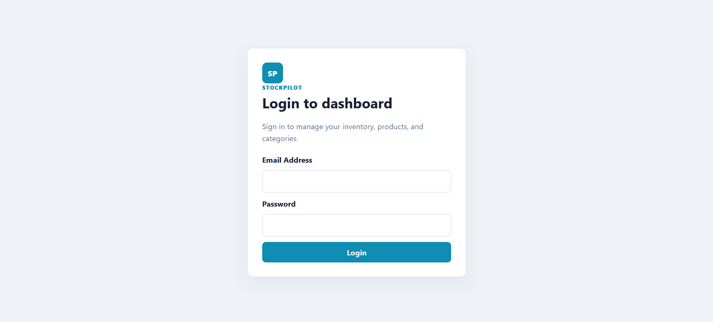

# StockPilot

A full-stack inventory management application built with Laravel and React.

StockPilot provides authenticated inventory management for products and categories, with role-based access control, product image uploads, and a dashboard for monitoring inventory data.

## Screenshots

### Dashboard



### Product Management



### Category Management



### Login



## Features

* Authentication with Laravel Sanctum
* Admin and regular user roles
* Backend-enforced role-based authorization
* Product management
* Category management
* Product image uploads
* Inventory dashboard
* Inventory value calculation
* Read-only access for regular users
* Admin-only create, update, and delete operations
* RESTful API
* MySQL database integration
* Automated feature tests
* Postman API collection

## Tech Stack

### Backend

* Laravel
* PHP
* Laravel Sanctum
* MySQL
* Eloquent ORM
* PHPUnit

### Frontend

* React
* Vite
* JavaScript
* CSS
* Lucide React

### Tools

* Git
* GitHub
* Postman

## Architecture

StockPilot is divided into a Laravel REST API backend and a React frontend.

```text
StockPilot/
├── backend/
│   ├── app/
│   │   ├── Http/
│   │   │   ├── Controllers/
│   │   │   └── Middleware/
│   │   └── Models/
│   ├── database/
│   │   ├── migrations/
│   │   └── seeders/
│   ├── routes/
│   │   └── api.php
│   └── tests/
│
├── frontend/
│   └── src/
│       ├── api.js
│       ├── App.jsx
│       ├── Dashboard.jsx
│       ├── Login.jsx
│       ├── CategoryManager.jsx
│       └── ProductManager.jsx
│
├── postman/
│   └── StockPilot.postman_collection.json
│
└── docs/
    └── screenshots/
```

The React frontend communicates with the Laravel API through authenticated HTTP requests.

## Authentication & Authorization

StockPilot uses Laravel Sanctum personal access tokens for API authentication.

The application has two roles:

* `admin`
* `user`

Authenticated users can view inventory data.

Administrators can:

* Create products
* Update products
* Delete products
* Create categories
* Update categories
* Delete categories

Authorization is enforced by the Laravel backend through dedicated middleware. Frontend controls are therefore not the security boundary.

## API Endpoints

### Health

```text
GET /api/health
```

### Authentication

```text
POST /api/login
GET  /api/me
POST /api/logout
```

### Categories

Authenticated users can view categories:

```text
GET /api/categories
GET /api/categories/{category}
```

Administrators can manage categories:

```text
POST   /api/categories
PUT    /api/categories/{category}
DELETE /api/categories/{category}
```

### Products

Authenticated users can view products:

```text
GET /api/products
GET /api/products/{product}
```

Administrators can manage products:

```text
POST   /api/products
PUT    /api/products/{product}
DELETE /api/products/{product}
```

Product creation and updates support image uploads.

## Postman Collection

A Postman collection is included for API testing:

```text
postman/StockPilot.postman_collection.json
```

The collection contains requests for:

* Health checks
* Authentication
* Current user
* Categories
* Products
* Logout

The collection uses variables for the API URL and authentication token.

## Getting Started

StockPilot consists of two applications that run independently.

### Backend Setup

Navigate to the backend directory:

```bash
cd backend
```

Install PHP dependencies:

```bash
composer install
```

Create the environment file:

```bash
cp .env.example .env
```

Generate the Laravel application key:

```bash
php artisan key:generate
```

Configure the database and administrator credentials in `.env`.

Example:

```env
APP_NAME=StockPilot

DB_DATABASE=StockPilotDB
DB_USERNAME=your_database_user
DB_PASSWORD=your_database_password

ADMIN_EMAIL=admin@example.com
ADMIN_PASSWORD=your_secure_password
```

Never commit `.env` or real credentials to the repository.

Run database migrations:

```bash
php artisan migrate
```

Create the administrator account:

```bash
php artisan db:seed
```

Create the public storage link:

```bash
php artisan storage:link
```

Start the Laravel development server:

```bash
php artisan serve
```

The API will normally be available at:

```text
http://127.0.0.1:8000
```

### Frontend Setup

Open another terminal and navigate to the frontend:

```bash
cd frontend
```

Install dependencies:

```bash
npm install
```

Create a `.env` file based on `.env.example`:

```env
VITE_API_URL=http://127.0.0.1:8000/api
```

Start the React development server:

```bash
npm run dev
```

Vite will provide the local frontend URL.

## Testing

Run the complete Laravel test suite:

```bash
cd backend
php artisan test
```

Build the React frontend:

```bash
cd frontend
npm run build
```

The project includes feature tests covering administrator authorization.

## Security

Sensitive configuration values are stored in environment variables and should never be committed to the repository.

The backend validates incoming product and category data before storing it in the database.

Administrative operations are protected by Laravel middleware and Sanctum authentication.

The frontend does not act as the final authorization layer.

## Project Status

StockPilot is a portfolio project focused on practical full-stack development, REST API design, authentication, authorization, database management, file storage, and application security.

## Author

**Somar Hassn**

IT Engineering — Cybersecurity
